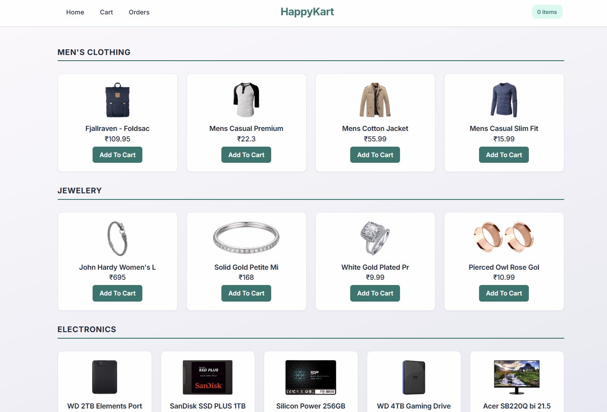
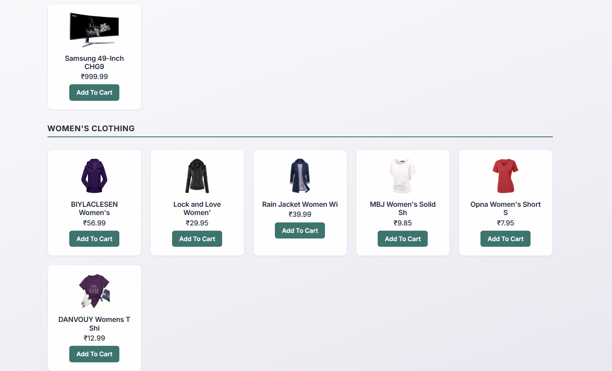
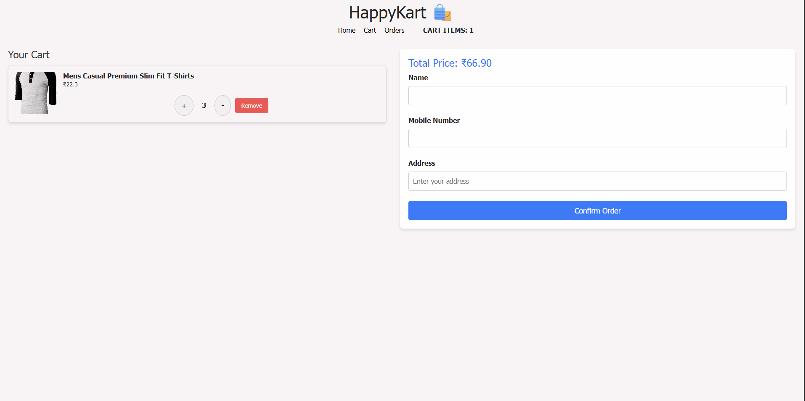
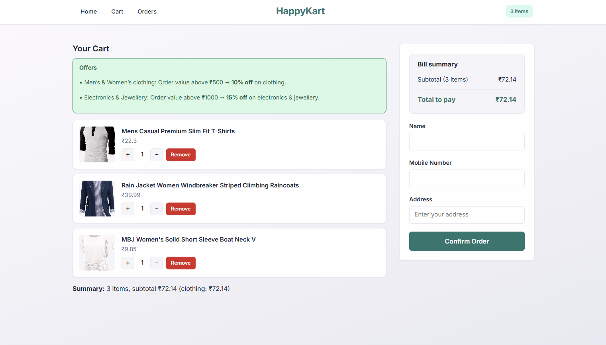
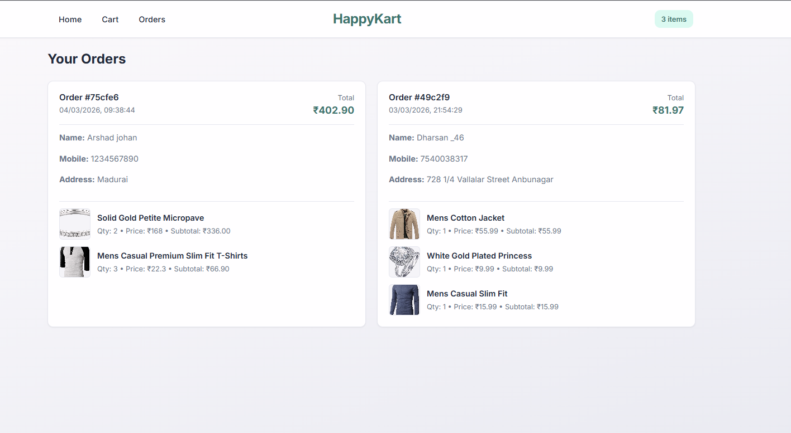

# 🛒 HappyKart – E-Commerce Website

A full-stack e-commerce web application with product listing, cart management, offers, and order history.

- **Frontend:** React 18, Redux, React Router, Axios  
- **Backend:** Node.js, Express 5  
- **Database:** MongoDB  
- **Product Data:** Fake Store API (GET products only)  
- **Cart & Orders:** Stored in custom backend  

---

## 🚀 Features

- 🏠 **Home Page**
  - Products by category (Men's Clothing, Women's Clothing, Electronics, Jewellery)
  - Grid layout
  - Add to Cart
  - Prices displayed in ₹

- 🛒 **Cart**
  - Add / Remove items
  - Increase / Decrease quantity
  - Guest user support using `localStorage`
  - Checkout form (Name, Mobile, Address)

- 📦 **Orders**
  - Place order
  - View previous orders
  - See items and total amount

- 🎉 **Offers**
  - 10% off on Clothing when total > ₹500
  - 15% off on Electronics & Jewellery when total > ₹1000

- 🎨 **UI**
  - Inter font
  - Gradient background
  - Navbar with live cart count

---

## 🛠 Tech Stack

| Part       | Technology Used |
|------------|-----------------|
| Frontend   | React 18, Redux, React Router, Axios |
| Backend    | Node.js, Express 5, Mongoose |
| Database   | MongoDB |
| API        | Fake Store API |

---

## 📂 Project Structure

```
E-Website/
├── E-Commerce-React/     # Frontend
│   ├── src/
│   │   ├── apis/
│   │   ├── components/
│   │   ├── pages/
│   │   ├── redux/
│   │   └── utils/
│   └── package.json
├── backend/              # Backend
│   ├── src/
│   │   ├── models/
│   │   ├── routes/
│   │   └── server.js
│   ├── .env
│   └── package.json
├── screenshots/          # UI Screenshots
└── README.md
```

---

## ⚙️ Prerequisites

- Node.js (v16+)
- MongoDB (Local or Atlas)
- npm or yarn

---

## 📦 Installation

### Backend

```bash
cd backend
npm install
```

Create `.env` inside backend:

```
PORT=5000
MONGODB_URI=mongodb://127.0.0.1:27017/ecommerce
```

---

### Frontend

```bash
cd E-Commerce-React
npm install
```

Make sure backend URL in:

```
E-Commerce-React/src/apis/backendApi.js
```

is:

```
http://localhost:5000/api
```

---

## ▶️ Run the Project

1. Start MongoDB
2. Start Backend:

```bash
cd backend
npm run dev
```

Runs on:
```
http://localhost:5000
```

3. Start Frontend:

```bash
cd E-Commerce-React
npm start
```

Runs on:
```
http://localhost:3000
```

---

## 🔌 API Endpoints

| Method | Endpoint | Description |
|--------|----------|-------------|
| GET    | `/api/health` | Health check |
| GET    | `/api/cart` | Get cart (requires `x-user-id` header) |
| POST   | `/api/cart` | Add to cart |
| PATCH  | `/api/cart/:productId` | Update quantity |
| DELETE | `/api/cart/:productId` | Remove item |
| POST   | `/api/orders` | Create order |
| GET    | `/api/orders` | Get user orders |

---

## 🖼 Screenshots

### 🏠 Home Page
<p align="center">
  
</p>

### 🏠 Home Page (Category View)
<p align="center">
  
</p>

### 🛒 Cart Page
<p align="center">
  
</p>

### 🛒 Cart with Offers Applied
<p align="center">
  
</p>

### 📦 Orders Page
<p align="center">
  
</p>

---

## 📌 Notes

- Products are fetched from Fake Store API.
- Backend is used only for cart and order management.
- No authentication is required (guest checkout supported).

---

## 👨‍💻 Author

**Sridharshan**
